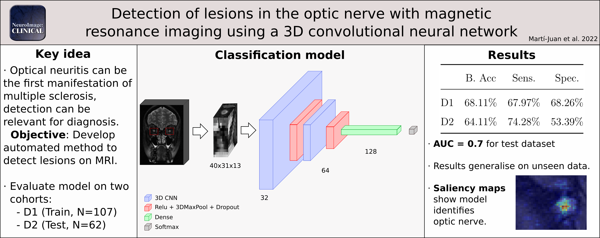

# Automatic detection of optical nerve lesions using a 3D convolutional neural network
Code for the paper "Automatic detection of optical nerve lesions using a 3D convolutional neural network", published in Neuroimage:Clinical.
DOI: https://doi.org/10.1016/j.nicl.2022.103187

## Abstract
Optic neuritis (ON) is one of the first manifestations of multiple sclerosis, a disabling disease with rising prevalence. Detecting optic nerve lesions could be a relevant diagnostic marker in patients with multiple sclerosis.
We aim to create an automated, interpretable method for optic nerve lesion detection from MRI scans.
We present a 3D convolutional neural network (CNN) model that learns to detect optic nerve lesions based on T2-weighted fat-saturated MRI scans. We validated our system on two different datasets (N=107 and 62) and interpreted the behaviour of the model using saliency maps.
The model showed good performance (68.11% balanced accuracy) that generalizes to unseen data (64.11%). The developed network focuses its attention to the areas that correspond to lesions in the optic nerve.
The method shows robustness and, when using only a single imaging sequence, its performance is not far from diagnosis by trained radiologists with the same constraint. Given its speed and performance, the developed methodology could serve as a first step to develop methods that could be translated into a clinical setting.

## Graphical Abstract:

## Repository organization:
(TODO)

## Credits
* Marcos Frías for the though, implementation and design of the experimental procedure, neural network architecture and evaluation.
* Aran Garcia-Vidal for the optic nerve lesion crop